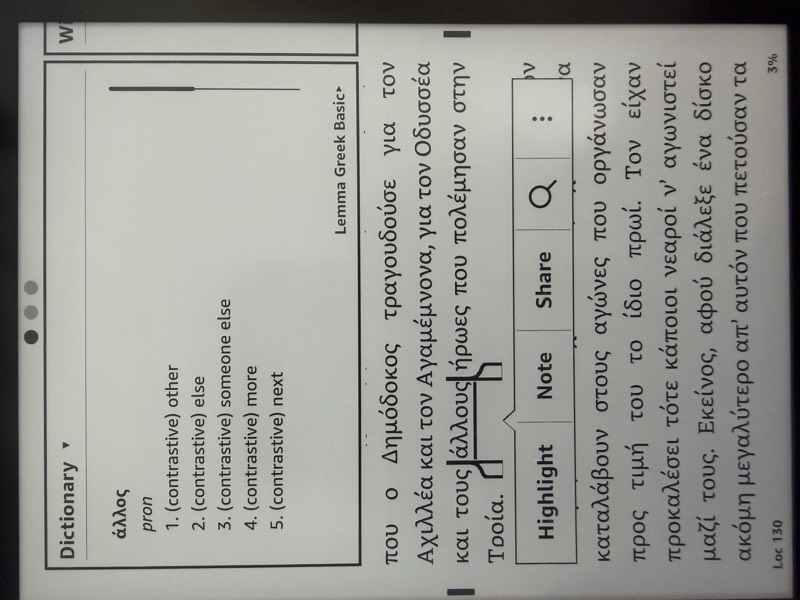

# Lemma Modern Greek Dictionary for Kindle

<p align="center">
  
</p>

A Greek-English dictionary for Kindle e-readers. 31K headwords, 574K inflected form lookups, built from Wiktionary data using [Kindling](https://github.com/ciscoriordan/kindling). Includes polytonic support for pre-1982 Greek texts.

| [Basic](https://github.com/ciscoriordan/lemma/releases) | Pro |
|:---:|:---:|
|  |  |
| <ul><li>Definitions</li><li>Inflections</li><li>Monotonic</li></ul> | <ul><li>Definitions</li><li>Inflections</li><li>Gender and variants</li><li>Etymology</li><li>Examples</li><li>Monotonic</li><li>Polytonic</li></ul> |

## Quick Install

### Installing Dictionaries on Your Kindle

1. **Connect your Kindle** to your computer via USB cable
2. **Open the Kindle drive** on your computer
3. **Navigate to the `documents/dictionaries` folder** on your Kindle
   - If the `dictionaries` folder doesn't exist, create it inside `documents`
4. **Copy the `.mobi` file(s)** from the `/dist` folder to `documents/dictionaries`
   - To generate `.mobi` files for sideloading, run with the `-m` flag (see below)
5. **Safely eject your Kindle** from your computer
6. **Restart your Kindle**:
   - Hold the power button for 40 seconds, or
   - Go to Settings > Device Options > Restart
7. The dictionary will be available after restart

### Setting as Default Greek Dictionary

1. **Open any Greek text** on your Kindle
2. **Select a Greek word** to look up
3. **Tap the dictionary name** at the bottom of the popup
4. **Select "Lemma Greek Basic"** or **"Lemma Greek"** from the list
5. The dictionary is now your default for Greek lookups

## Pre-built Dictionaries

Ready-to-use dictionary files are available in the `/dist` folder:

### Greek-English Dictionary

- `lemma_greek_en_[date]_basic.mobi` - Basic edition: definitions and inflections
- `lemma_greek_en_[date].mobi` - Pro edition: adds gender/variant info, etymology, cross-reference links, and polytonic lookup support

## Features
- **Inflection Support**: Automatically links inflected forms to their lemmas, with 2.76M form-to-lemma mappings from [Dilemma](https://github.com/ciscoriordan/dilemma) when available
- **Lemma Equivalences**: Bridges cases where Wiktionary and Dilemma use different canonical forms for the same word (e.g., `τρώω`/`τρώγω`, `λέω`/`λέγω`), recovering ~742K additional inflections via 6,281 auto-generated equivalence pairs
- **Pre-Ranked Inflections**: When [Dilemma](https://github.com/ciscoriordan/dilemma)'s `mg_ranked_forms.json` is available (from [HuggingFace Hub](https://huggingface.co/datasets/ciscoriordan/dilemma-data) or locally), inflections arrive pre-ranked by corpus frequency and case-deduplicated. Case variants (φας/Φας) are added after the inflection cap, not before, so each slot goes to a unique form. Falls back to local ranking via [FrequencyWords](https://github.com/hermitdave/FrequencyWords) (OpenSubtitles 2018) if ranked forms aren't available
- **Polytonic Support** (Pro): Corpus-attested polytonic forms from Greek Wikisource, enabling lookups in pre-1982 polytonic texts
- **Gender and Variants** (Pro): POS line shows gender and key forms (e.g., "noun, feminine (plural θάλασσες)")
- **Etymology** (Pro): Word origins with transliterations stripped for clean display
- **Cross-References** (Pro): Clickable links between related entries
- **Clean Formatting**: Optimized for Kindle's dictionary popup interface
- **Testing Mode**: Create smaller dictionaries for testing (1-100% of entries)

## Building from Source

### Prerequisites

- Python 3.8+
- [Kindling](https://github.com/ciscoriordan/kindling) (optional, only needed for `.mobi` generation with `-m` flag)
- Works on macOS, Linux, and Windows

### Installation

```bash
# Clone the repository
git clone https://github.com/ciscoriordan/lemma.git
cd lemma

# Run the generator (produces EPUB by default)
python3 greek_kindle_dictionary.py [options]
# On Windows, use: python greek_kindle_dictionary.py [options]
```

### Options

```bash
# Generate dictionary (EPUB output)
python3 greek_kindle_dictionary.py

# Also generate .mobi for sideloading
python3 greek_kindle_dictionary.py -m

# Generate a test dictionary with only 10% of entries
python3 greek_kindle_dictionary.py -l 10
```

### Command Line Arguments

- `-l, --limit PERCENT`: Limit to first X% of words (useful for testing)
- `-m, --mobi`: Also generate `.mobi` via Kindling (for sideloading)
- `-i, --inflections N`: Max inflections per headword (default: 255)
- `--links`: Enable clickable cross-references between entries
- `--etymology`: Include etymology information in entries
- `--polytonic`: Add polytonic breathing/accent variants as inflections, for looking up words in polytonic Modern Greek books. Increases file size.
- `-h, --help`: Show help message

## Data Sources

The dictionaries are built from:

- **Primary Source**: [Kaikki.org](https://kaikki.org/) - Machine-readable Wiktionary data (definitions, POS, etymology)
- **Inflection Data** (optional): [Dilemma](https://github.com/ciscoriordan/dilemma) - Greek lemmatizer with 2.76M Modern Greek form-to-lemma mappings compiled from English and Greek Wiktionary, treebank corpora, and LSJ expansion
- **Ranked Inflections** (optional): Dilemma's `mg_ranked_forms.json` from the [`ciscoriordan/dilemma-data`](https://huggingface.co/datasets/ciscoriordan/dilemma-data) HuggingFace dataset provides pre-ranked, case-deduplicated inflection lists per lemma. Downloaded automatically if `huggingface_hub` is installed.
- **Frequency Data** (fallback): [FrequencyWords](https://github.com/hermitdave/FrequencyWords) - Word frequency lists derived from OpenSubtitles 2018 corpus, used to rank inflections when pre-ranked forms are not available
- **Fallback Data**: Pre-downloaded JSONL files in the repository

### Optional Configuration

To use local kaikki dumps or Dilemma inflection data, create a `.env` file in the project root:

```
KAIKKI_LOCAL_DIR=/path/to/kaikki/dumps
DILEMMA_DATA_DIR=/path/to/dilemma/data
```

When `DILEMMA_DATA_DIR` is set and `mg_lookup_scored.json` (or `mg_lookup.json`) is found, the generator will supplement kaikki-derived inflections with Dilemma's more comprehensive mappings. Without it, inflections are extracted from kaikki data only.

The generator also automatically looks for `mg_ranked_forms.json` (pre-ranked inflections) in three locations: `data/` in this project, the `DILEMMA_DATA_DIR`, or the [`ciscoriordan/dilemma-data`](https://huggingface.co/datasets/ciscoriordan/dilemma-data) HuggingFace dataset (requires `pip install huggingface_hub`).

#### Lemma Equivalences

Wiktionary and Dilemma sometimes disagree on the canonical lemma for a word (e.g., Wiktionary uses `τρώω` for "eat" while Dilemma files all 165 inflections under `τρώγω`). To bridge this, run:

```bash
python3 generate_mg_equivalences.py
```

This cross-references the two data sources, uses corpus frequency as a tiebreaker, and writes `data/mg_lemma_equivalences.json`. The dictionary generator loads this automatically. Without it, inflections filed under a different canonical form in Dilemma will be missed.

### Related Projects

- [Dilemma](https://github.com/ciscoriordan/dilemma) - Greek lemmatizer. Provides the inflection lookup tables used by Lemma.
- [Opla](https://github.com/ciscoriordan/opla) - Greek POS tagger and dependency parser, built on Dilemma for lemmatization.

## Dictionary Content

The dictionaries include:

- **Headwords**: Main dictionary entries
- **Inflected Forms**: Automatically redirect to their lemmas
- **Part of Speech**: Grammatical category
- **Definitions**: Multiple numbered definitions where applicable
- **Etymology**: Word origins and history (English dictionary only)
- **Domain Tags**: Subject area indicators (e.g., γλωσσολογία, γραμματική)

### Inflection Limit

Each headword includes up to 255 unique inflected forms (`MAX_INFLECTIONS` in `lib/html_generator.py`), ranked by corpus frequency when pre-ranked forms from Dilemma are available. Use `-i N` to adjust.

Pro builds also include up to 255 polytonic variants per headword (`MAX_POLYTONIC`), sourced from attested forms in Greek Wikisource via Dilemma's `mg_polytonic_ranked.json`. This enables lookups in polytonic Modern Greek texts (pre-1982 orthography, Katharevousa literature, etc.).

### Excluded Content

The following are filtered out as they cannot be selected in Kindle texts:

- Prefixes and suffixes (e.g., `-ικός`, `προ-`)
- Combining forms and clitics
- Individual letters and symbols
- Abbreviations and contractions

## Troubleshooting

### Dictionary Not Appearing

- Ensure the `.mobi` file(s) are in the `documents/dictionaries` folder
- **Always restart your Kindle** after adding new dictionaries
- If still not appearing, try a hard restart (hold power button for 40 seconds)

### Lookup Not Working

- Make sure you've set the dictionary as default for Greek
- Some older Kindle models may have limited Greek support

### Building Issues

- **Kindling not found**: Only needed for `.mobi` generation (`-m` flag). Download from [Kindling releases](https://github.com/ciscoriordan/kindling/releases)
- **Download freezes**: Use pre-downloaded data files from the repository
- **Memory issues**: Use the `-l` option to build smaller test dictionaries first

## License

MIT - Copyright (c) 2026 Francisco Riordan

- **Dictionary content and data**: [Creative Commons Attribution-ShareAlike 4.0](https://creativecommons.org/licenses/by-sa/4.0/) (derived from Wiktionary)
- **Frequency data** (`data/el_full.txt`): [MIT License](https://github.com/hermitdave/FrequencyWords/blob/master/LICENSE) (from FrequencyWords/OpenSubtitles)

## Acknowledgments

- Wiktionary contributors for the source data
- [Kaikki.org](https://kaikki.org/) for providing machine-readable Wiktionary dumps
- [Dilemma](https://github.com/ciscoriordan/dilemma) for Greek lemmatization and inflection data
- [Kindling](https://github.com/ciscoriordan/kindling) for MOBI generation
- [FrequencyWords](https://github.com/hermitdave/FrequencyWords) for corpus frequency data (MIT license)
