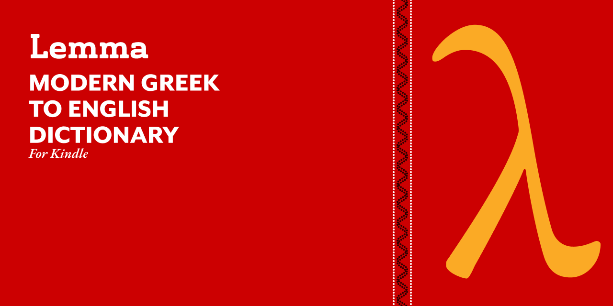
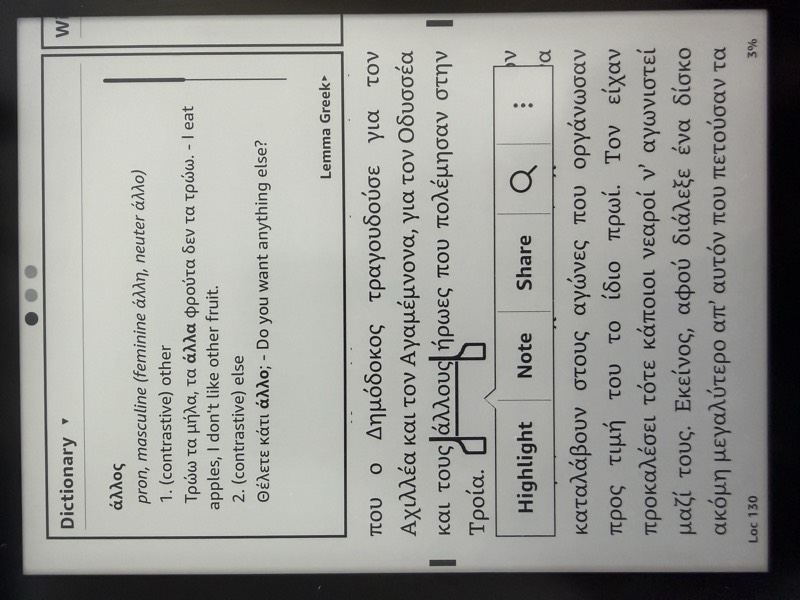

# Lemma: Modern Greek Dictionary for Kindle

<p align="center">
  
</p>

A free Modern Greek-English dictionary for Kindle e-readers. 31K headwords, 568K inflected form lookups, built from Wiktionary data using [Kindling](https://github.com/ciscoriordan/kindling) (a reverse-engineered, ~7,000x faster *kindlegen* replacement). The generator and all helper tools are written in Rust.

<p align="center">
  
</p>

Lemma ships as a single unified edition with every feature the generator supports - definitions, inflections, monotonic and polytonic lookup, gender and declension info, etymology, usage examples, and clickable cross-references.

## Quick Install

### Installing on Your Kindle

1. **Connect your Kindle** to your computer via USB cable
2. **Open the Kindle drive** on your computer
3. **Navigate to the `documents/dictionaries` folder** on your Kindle
   - If the `dictionaries` folder doesn't exist, create it inside `documents`
4. **Download `lemma_greek_en.mobi`** from [GitHub Releases](https://github.com/ciscoriordan/lemma/releases) and copy it to `documents/dictionaries`
   - Alternatively, you can build the `.mobi` locally by running with the `-m` flag (see below)
5. **Safely eject your Kindle** from your computer
6. **Restart your Kindle**:
   - Hold the power button for 40 seconds, or
   - Go to Settings > Device Options > Restart
7. The dictionary will be available after restart

### Setting as Default Greek Dictionary

1. **Open any Greek text** on your Kindle
2. **Select a Greek word** to look up
3. **Tap the dictionary name** at the bottom of the popup
4. **Select "Lemma Greek Dictionary"** from the list
5. The dictionary is now your default for Greek lookups

## Pre-built Dictionary

Ready-to-use dictionary files are available on the [Releases page](https://github.com/ciscoriordan/lemma/releases):

- `lemma_greek_en.mobi` - the full dictionary for sideloading to Kindle devices
- `lemma_greek_en.epub` - the source EPUB (most users want the MOBI)

Filenames are stable across versions, so each new release replaces the previous file in `documents/dictionaries/` on your Kindle in place. Check the **Build Info** section on the dictionary's copyright page to see which build you have installed (lemma generator version, build date, and Wiktionary extraction date).

## Features
- **Inflection Support**: Automatically links inflected forms to their lemmas, with 2.74M form-to-lemma mappings from [Dilemma](https://github.com/ciscoriordan/dilemma) when available
- **Lemma Equivalences**: Bridges cases where Wiktionary and Dilemma use different canonical forms for the same word (e.g., `τρώω`/`τρώγω`, `λέω`/`λέγω`), recovering ~742K additional inflections via 6,281 auto-generated equivalence pairs
- **Pre-Ranked Inflections**: When [Dilemma](https://github.com/ciscoriordan/dilemma)'s `mg_ranked_forms.json` is available (from [HuggingFace Hub](https://huggingface.co/datasets/ciscoriordan/dilemma-data) or locally), inflections arrive pre-ranked by corpus frequency and case-deduplicated. Case variants (φας/Φας) are added after the inflection cap, not before, so each slot goes to a unique form. Falls back to local ranking via [FrequencyWords](https://github.com/hermitdave/FrequencyWords) (OpenSubtitles 2018) if ranked forms aren't available
- **Polytonic Support**: Corpus-attested polytonic forms from Greek Wikisource, enabling lookups in pre-1982 polytonic texts
- **Gender and Variants**: POS line shows gender and key forms (e.g., "noun, feminine (plural θάλασσες)")
- **Etymology**: Word origins with transliterations stripped for clean display
- **Cross-References**: Clickable links between related entries
- **Clean Formatting**: Optimized for Kindle's dictionary popup interface
- **Testing Mode**: Create smaller dictionaries for testing (1-100% of entries)

## Building from Source

### Prerequisites

- Rust 1.80+ (edition 2024)
- A local checkout of [Kindling](https://github.com/ciscoriordan/kindling), since it is not yet published to crates.io. This is required to build lemma itself - lemma uses Kindling as a library for MOBI generation, and the MOBI step is now always invoked via the library (there is no shell-out to `kindling-cli`).
- Works on macOS, Linux, and Windows

### Installation

```bash
# Clone both repos side by side
git clone https://github.com/ciscoriordan/lemma.git
git clone https://github.com/ciscoriordan/kindling.git
cd lemma

# Wire up the local kindling checkout. This writes a gitignored
# .cargo/config.toml that patches crates.io for you.
./scripts/setup-local-kindling.sh
# (or set KINDLING_PATH=/path/to/kindling before running it)

# Release build
cargo build --release

# Run the generator (produces EPUB by default)
./target/release/lemma [options]
```

Once Kindling is published to crates.io, `./scripts/setup-local-kindling.sh` becomes optional: the `kindling = "0.9"` line in `Cargo.toml` will resolve directly.

### Options

```bash
# Generate dictionary (EPUB output)
cargo run --release

# Also generate .mobi for sideloading
cargo run --release -- -m

# Generate a test dictionary with only 10% of entries
cargo run --release -- -l 10
```

### Command Line Arguments

- `-l, --limit PERCENT`: Limit to first X% of words (useful for testing)
- `-m, --mobi`: Also generate `.mobi` via Kindling (for sideloading)
- `-i, --inflections N`: Max inflections per headword (default: 255)
- `--front-matter PATH`: Override the copyright/usage front-matter fields (edition name, tagline, features, copyright holder, extra copyright lines, data sources) from a JSON file. Unspecified fields fall through to the built-in defaults.
- `-h, --help`: Show help message

Cross-references, etymology, usage examples, and polytonic lookups are enabled by default - previous builds called these "Pro" features, but lemma now ships a single unified edition with the full feature set.

## Data Sources

The dictionaries are built from:

- **Primary Source**: [Kaikki.org](https://kaikki.org/) - Machine-readable Wiktionary data (definitions, POS, etymology)
- **Inflection Data** (optional): [Dilemma](https://github.com/ciscoriordan/dilemma) - Greek lemmatizer with 2.74M Modern Greek form-to-lemma mappings compiled from English and Greek Wiktionary, treebank corpora, and LSJ expansion
- **Ranked Inflections** (optional): Dilemma's `mg_ranked_forms.json` from the [`ciscoriordan/dilemma-data`](https://huggingface.co/datasets/ciscoriordan/dilemma-data) HuggingFace dataset provides pre-ranked, case-deduplicated inflection lists per lemma. Downloaded automatically if `huggingface_hub` is installed.
- **Frequency Data** (fallback): [FrequencyWords](https://github.com/hermitdave/FrequencyWords) - Word frequency lists derived from OpenSubtitles 2018 corpus, used to rank inflections when pre-ranked forms are not available
- **Fallback Data**: Pre-downloaded JSONL files in the repository

### Optional Configuration

To use local kaikki dumps or Dilemma inflection data, create a `.env` file in the project root:

```
KAIKKI_LOCAL_DIR=/path/to/kaikki/dumps
DILEMMA_DATA_DIR=/path/to/dilemma/data
```

When `DILEMMA_DATA_DIR` is set and `mg_lookup_scored.json` (or `mg_lookup.json`) is found, the generator will supplement kaikki-derived inflections with Dilemma's more comprehensive mappings. Without it, inflections are extracted from kaikki data only.

#### Kaikki Extraction Date

The downloader records the real Kaikki extraction date (the date Wiktionary was snapshotted, not the date you ran the build) and renders it on the dictionary's copyright page. The cascade is:

1. HTTP `Last-Modified` header on the Kaikki JSONL URL (direct download).
2. The "extracted on YYYY-MM-DD" line on Kaikki's language index page (direct download, fallback).
3. The file mtime of the local dump (when `KAIKKI_LOCAL_DIR` is used).
4. The hardcoded constant for any committed fallback snapshot.

On a successful download the downloader writes a tiny `greek_data_<lang>.jsonl.meta` sidecar next to the dump containing `{"extraction_date": ..., "source_url": ..., "downloaded_at": ...}`. Subsequent builds that reuse the cached dump read the sidecar so the extraction date survives across runs. Sidecars are gitignored.

The generator also automatically looks for `mg_ranked_forms.json` (pre-ranked inflections) in three locations: `data/` in this project, the `DILEMMA_DATA_DIR`, or the [`ciscoriordan/dilemma-data`](https://huggingface.co/datasets/ciscoriordan/dilemma-data) HuggingFace dataset (requires `pip install huggingface_hub`).

#### Lemma Equivalences

Wiktionary and Dilemma sometimes disagree on the canonical lemma for a word (e.g., Wiktionary uses `τρώω` for "eat" while Dilemma files all 165 inflections under `τρώγω`). To bridge this, run:

```bash
cargo run --release --bin generate_mg_equivalences
```

This cross-references the two data sources, uses corpus frequency as a tiebreaker, and writes `data/mg_lemma_equivalences.json`. The dictionary generator loads this automatically. Without it, inflections filed under a different canonical form in Dilemma will be missed.

### Related Projects

- [Kindling](https://github.com/ciscoriordan/kindling) - MOBI generator for Kindle dictionaries, books, and comics.
- [Dilemma](https://github.com/ciscoriordan/dilemma) - Greek lemmatizer. Provides the inflection lookup tables used by Lemma.
- [Opla](https://github.com/ciscoriordan/opla) - Greek POS tagger and dependency parser, built on Dilemma for lemmatization.

## Dictionary Content

The dictionary includes:

- **Headwords**: Main dictionary entries
- **Inflected Forms**: Automatically redirect to their lemmas
- **Part of Speech**: Grammatical category, gender, and key forms
- **Definitions**: Multiple numbered definitions where applicable
- **Etymology**: Word origins and history
- **Usage Examples**: Attested example sentences with translations
- **Cross-References**: Clickable links between related entries
- **Domain Tags**: Subject area indicators (e.g., γλωσσολογία, γραμματική)

### Inflection Limit

Each headword includes up to 255 unique inflected forms (`MAX_INFLECTIONS` in `src/html_gen.rs`), ranked by corpus frequency when pre-ranked forms from Dilemma are available. Use `-i N` to adjust.

Each headword also carries up to 255 polytonic variants (`MAX_POLYTONIC`), sourced from attested forms in Greek Wikisource via Dilemma's `mg_polytonic_ranked.json`. This enables lookups in polytonic Modern Greek texts (pre-1982 orthography, Katharevousa literature, etc.).

### Excluded Content

The following are filtered out as they cannot be selected in Kindle texts:

- Prefixes and suffixes (e.g., `-ικός`, `προ-`)
- Combining forms and clitics
- Individual letters and symbols
- Abbreviations and contractions

## Troubleshooting

### Dictionary Not Appearing

- Ensure the `.mobi` file(s) are in the `documents/dictionaries` folder
- **Always restart your Kindle** after adding new dictionaries
- If still not appearing, try a hard restart (hold power button for 40 seconds)

### Lookup Not Working

- Make sure you've set the dictionary as default for Greek
- Some older Kindle models may have limited Greek support

### Building Issues

- **Kindling not found**: Only needed for `.mobi` generation (`-m` flag). Download from [Kindling releases](https://github.com/ciscoriordan/kindling/releases)
- **Download freezes**: Use pre-downloaded data files from the repository
- **Memory issues**: Use the `-l` option to build smaller test dictionaries first

## Dictionary Layout

Dictionary content is split across per-letter `content_NN.html` files (`content_01.html` … `content_24.html` for Α…Ω, plus `content_00.html` for non-Greek headwords). Each file is a standalone XHTML document with the Kindle dictionary `<idx:*>` markup. Cross-reference links are file-qualified (`content_11.html#hw_λέγω`). The NCX also exposes a jump-to-letter TOC.

Per-letter splitting is required by [Kindle Publishing Guidelines §15.5](https://kindlegen.s3.amazonaws.com/AmazonKindlePublishingGuidelines.pdf) - Amazon's server-side dictionary converter can time out on a single very large XHTML file. Kindling reads every spine entry and produces a single MOBI, so the MOBI output is still one file per edition.

## Git Hooks

A pre-commit hook runs [Kindling's](https://github.com/ciscoriordan/kindling) `kindling validate` against any dictionary OPF whose directory has staged changes, so broken manuscripts can't be committed. It checks against the Amazon Kindle Publishing Guidelines (KPG 2026.1).

Install it once per clone:

```bash
./scripts/install-hooks.sh
```

This symlinks `.git/hooks/pre-commit` to the tracked `scripts/pre-commit`, so future updates to the hook are picked up automatically.

Behavior:

- If the commit doesn't touch any `lemma_greek_en_*/` directory, the hook exits immediately.
- For each changed dict directory, it finds the `.opf` and runs `kindling validate` on it. A non-zero exit aborts the commit with the failing findings.
- If `kindling-cli` isn't on `PATH` (and isn't at `~/Documents/kindling/target/release/kindling-cli`), the hook prints a warning and lets the commit through.
- Bypass with `git commit --no-verify` when you need to commit in spite of validation output.

## License

MIT - © 2026 Francisco Riordan

- **Dictionary content and data**: [Creative Commons Attribution-ShareAlike 4.0](https://creativecommons.org/licenses/by-sa/4.0/) (derived from Wiktionary)
- **Frequency data** (`data/el_full.txt`): [MIT License](https://github.com/hermitdave/FrequencyWords/blob/master/LICENSE) (from FrequencyWords/OpenSubtitles)

## Acknowledgments

- Wiktionary contributors for the source data
- [Kaikki.org](https://kaikki.org/) for providing machine-readable Wiktionary dumps
- [Dilemma](https://github.com/ciscoriordan/dilemma) for Greek lemmatization and inflection data
- [Kindling](https://github.com/ciscoriordan/kindling) for MOBI generation
- [FrequencyWords](https://github.com/hermitdave/FrequencyWords) for corpus frequency data (MIT license)
